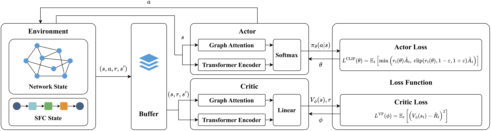
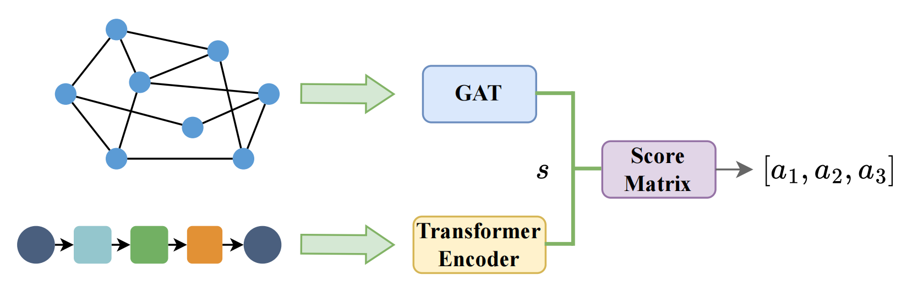
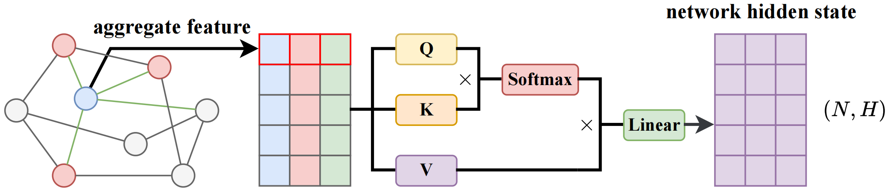
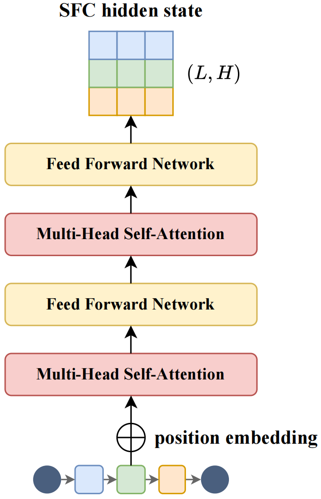
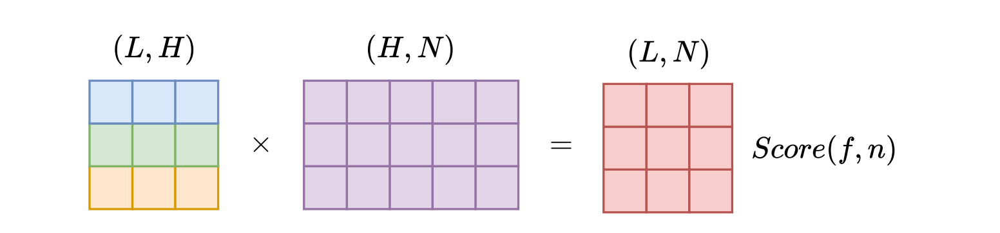

# Deep Reinforcement Learning for Service Function Chain Placement with Graph Attention and Transformer Encoder

## Introduction

This repository contains the implementation of the paper of paper *Deep Reinforcement Learning for Service Function Chain Placement with Graph Attention and Transformer Encoder*. 

<div align="center"> </div>

In this paper, we propose a novel DRL approach based on Proximal Policy Optimization (PPO), which leverages a Graph Attention Network (GAT) and a Transformer encoder to generate a score Matrix for SFC placement (GTMSFC).
Our method employs the GAT to capture local topological information and the Transformer encoder to model the sequential dependencies within the SFC.
By aggregating the network and SFC states into a score matrix, our method generates the complete placement action for the entire SFC in a single forward pass.
Experimental results demonstrate that our proposed approach achieves an SFC acceptance ratio improvement of up to 37.46% while simultaneously reducing resource violations, power consumption, and end-to-end SFC latency.

<div align="center">
  
  <p><b>Model Design</b></p>

  
  <p><b>GAT Network State Extraction</b></p>

  
  <p><b>Transformer Encoder SFC State Extraction</b></p>

  
  <p><b>Score Matrix Generation</b></p>
</div>

## Requirements

- Python 3.9.21
- [CUDA 12.6.0](https://developer.nvidia.com/cuda-12-6-0-download-archive)
- PyTorch 2.6.0

```
pip install torch==2.6.0 torchvision==0.21.0 torchaudio==2.6.0 --index-url https://download.pytorch.org/whl/cu126
```

Other required libraries are listed in `requirements.txt`.

```
pip install -r requirements.txt
```

## Quick Start

The trained agent models are stored in `save/model/Chinanet` and `save/model/Cogentco`.

To evaluate all methods and reproduce the results, simply run:

```
python main.py
```

By default, the script evaluates the Chinanet topology. You can specify a different topology by modifying the --graph argument:

```
python main.py --graph Cogentco
```

Note that to ensure a fair comparison and reproducibility, the random seed is fixed at 42 for all evaluations.

You can view and modify all available hyperparameters and system options in `config.py`. 

All training/evaluation results and performance plots are automatically saved in `save/result`.

## Acknowledgement

This repository builds upon the open-source implementation provided by [Ruben Solozabal](https://github.com/rubensolozabal/vnf_placement_optimization_rl). 

The specific topology files used in our evaluation were obtained from the GitHub repository https://github.com/sk2/topologyzoo/.

We sincerely thank the authors for their valuable contribution.

## Author
**Shuxin Wang**, PhD student at Zhejiang University

Hangzhou, Zhejiang, China

Email: shuxinwang@zju.edu.cn